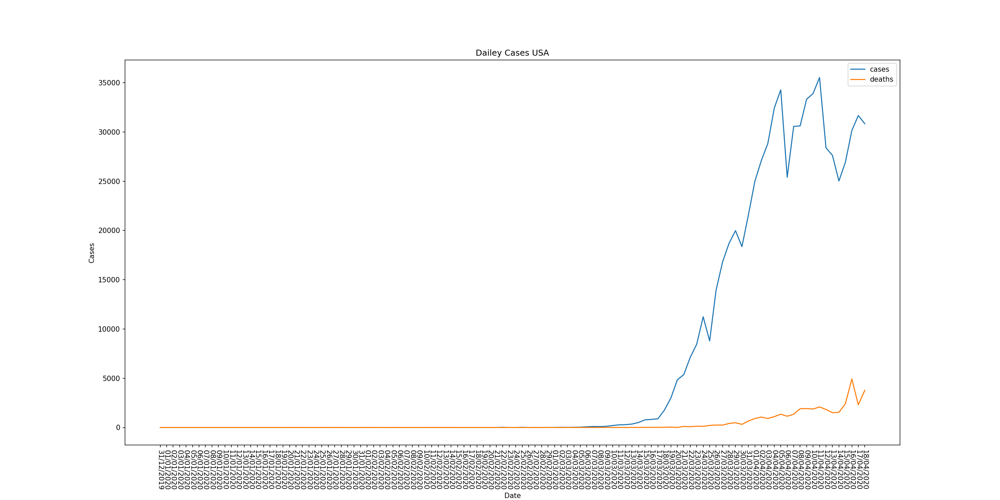

# COVID-19 Plots

## Data
Data Source:
https://opendata.ecdc.europa.eu/covid19/casedistribution/csv

The file needs to be renamed(`data_all.csv`) and moved into the `data/` directory. 

## Installation and usage
This script works with python 3.7.4. `wget` needs to be installed for Windows and Mac users.

### Cloning and installation
```bash
git clone git@github.com:FelixLueth/covid-19-plots.git
cd covid-19-plots
pip install -r requirements.txt
```

### Fetch data
```bash
wget https://opendata.ecdc.europa.eu/covid19/casedistribution/csv
mv csv data/data_all.csv
```
### Single Plot example
```bash
python src/single_plot.py USA 
```


### Double Plot example
```bash
python src/double_plot.py USA Germany
```


## Output

The output can be found in `output/`
